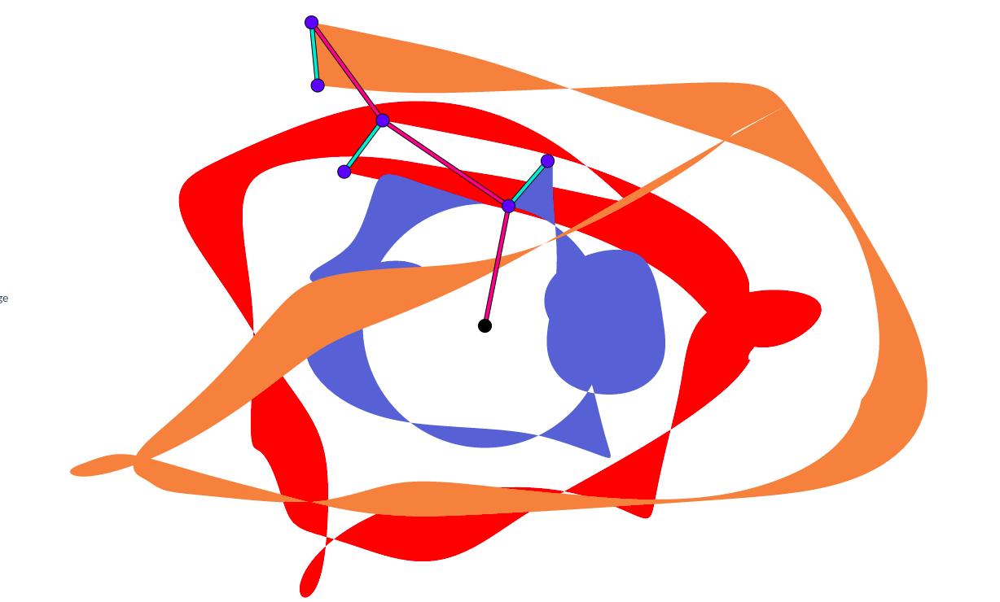

# Kempe Simulator

An interactive interface for linkages that draw.

This was a final project for [6.849 Fall 2020](https://courses.csail.mit.edu/6.849/fall20/) by Eyal Perry that continued the work done in a previous final project for [6.849 Fall 2012](https://github.com/6849-2020/kempe-sim-2012) that had a physics simulation for rigid linkages.

## How to Use

### Normal Mode

In this mode you can drag the vertices to move the linkage (if it's not constrained). 
Dragging anywhere else on the screen will drag the whole canvas. 
You can zoom in and out using the scroll wheel.

Notice: on the left there are two Physics Engines*:
- **Box2D** is a fast, yet inaccurate engine. It supported options such as undamped motion (fun!) and gravity.
- **C.H.S.Z** is a slower (and more buggy) but for simple linkages produces very precise results.

### Edit Mode

In this mode you can add/remove points and edges. There are three types of points:
- Fixed - cannot move
- Free - can move
- Pen - can move just like Free, but will draw a trace

There are also two types of edges: regular and "Pen". Pen edges will draw a trace as they move.

### Import FOLD

You can import files in FOLD format. The mandatory fields are:
- vertices_coords
- edges_vertices
Addtionally, you can specify the following fields:
- vertices_kempe:assignment : F/P/X (Free/Pen/fiXed)
- edges_assignment : F/P (Free/Pen)
For more information on the FOLD format please refer to the [FOLD spec](https://github.com/edemaine/fold/blob/master/doc/spec.md)

### Export Linkage to FOLD

You can save your linkages to the FOLD format. The file will store the corrent configuration of the linkage.

### Export Drawing to SVG

You can save your drawing in SVG format.

### Linkage Library

There is a small set of pre-made linkages to experiment with, such as the [Peaucellier–Lipkin Linkage](https://en.wikipedia.org/wiki/Peaucellier%E2%80%93Lipkin_linkage) and [Jansen's Linkage](https://en.wikipedia.org/wiki/Jansen%27s_linkage). If you designed an interesting linkage, [contact me](mailto:eyalp@mit.edu) and I will add it! (alternatively, submit a Pull Request)

## TODOs:

- User Interface:
  - Mac Support
  - In addition to keyboard shortcut, add an intuitive UI tht wllows to select points/edges and change their type or delete them
  - Instead of placing points, define edge lengths
  - Snap to Grid
- Linkages:
  - Gluing Kempe Linkages: click on two edges and add an angle gadget (multiplcator/translator) for that angle
  - Design Linkages to draw all letters of the English alphabet
- Move points in a uniform circular motion around another point (WIP in branch "zund")
- Draw arbitrary curves using Fourier series terms

## Acknowledgements

- Yanping Chen, Laura Hallock, Eric Söderström, Xinyi Zhang for their original implementation.
- Amanda Ghassaei for the UI and theme behind [OrigamiSimulator](https://origamisimulator.org/) and the inspiration to develop beautiful tools for better understanding of folding
- Prof. Erik Demaine, Martin Demaine, Klara Mundilova, Yevhenii Diomidov, Erik Strand and all students of 6.849 for inspiration and support.

  - 
